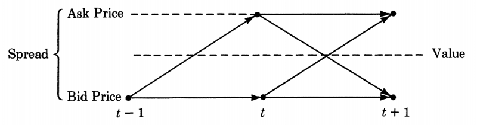

[Roadmap Homepage](../articles_index.md)

## Introduction to Liquidity and Market Microstructure 
*Liquidity is the ability to buy and sell securities quickly, and relatively small price impact. *

*The Great Wave off the Coast of Kanagawa - Katsushika Hokusai (1831)*

I start off with a strange tale that a wise colleague once shared with me. 
Imagine it's the middle of the day, you're standing on Bay St. (Toronto's Wall Street) and you are trying to sell a Rolex. You'd probably get the job done, and at a decent price too! Now, try doing the same thing at three in the morning. 

While I don't recommend buying expensive watches from random folks standing on streets, there is a lot of insight to dissect from my colleagues story. First, one thing to note is that we can assume value of the Rolex does not change, regardless of time - let's call this the fair value, a concept we can extend to securities that trade in markets. How the fair value of a security is calculated is a different beast in-of-itself, and can be based on a variety of things such as supply and demand, company balance sheet, or even shifts in political regimes. For our purposes of this article, we assume that our security has a true fair value that has been calculated, and is known. 

Secondly, we were able to sell our Rolex both quickly and for a good price during a busy time in a major financial district. This is an example of a liquid market, one where we were able to sell our security relatively quickly, and at a price that is close to the fair value. On the flip side, trying to sell our Rolex at three in the morning when presumably there's very few people hanging around, will pose a much greater challenge. If we were desperate to get rid of this Rolex, we may have to offer a huge discount to the fair value in order to land a sale. This is an example of an illiquid market, where not many transactions take place, and those that do are often at prices far removed from the fair value.

Tying this to our previous article where we introduced bid-ask spreads, we would imagine that securities that trade in liquid markets would have tight (small) spreads, and securities that trade in illiquid markets would have wide spreads. 

One of my personal favorite books on liquidity, that covers both fundamentals as well as indepth concepts, is "Market Liquidity" by Foucal, Pagano, and Roel *fix this with the double dots. 

### So, why should you care about Market Liquidity? 

To take from FPR, "Asset managers and ordinary investors care about liquidity insofar as it affects the return on their investments, simply because illiquid securities cost more to buy, and sell for less. Therefore, illiquidity eats into the return…For the same reasons, liquidity is a key of all professionals who specialize in providing securities trading services…locating the most liquid trading venue or timing trades so as to minimize trading costs is the key to providing good quality service."
So- long story short, having a solid grasp of liquidity can help you to make better decisions when trading, such as to maximize your P/L. Another reason to have an understanding of liquidity is that many people simply 
One of my former bosses and mentor once told me - "I've never seen a bad backtest". 

## Measuring Liquidity

Now that we have a qualitative understanding of liquidity, we seek to define liquidity using quantitative metrics. There are many ways of doing so throughout literature, but I will introduce some common methods, in order of difficulty.

- Quoted Spread
- VWAP
- Roll's Measure 
- Price Impact Regression

#### Quoted Spread
The first method I introduce is by far the simplest, as well as one of the most intuitive. The Quoted Spread is simply the current spread divided by the mid-price

$$
\begin{align*}
\frac{\text{Ask} - \text{Bid}}{\text{Mid}}
\end{align*}
$$

Generally speaking, the **larger the Quoted Spread, the less liquid a market is**. Recall our definition of liquidity, specifically that a security can be sold with minimum price impact, or deviation from the fair value. The assumptions here is that the mid-price reflects the fair value, thus large spreads mean that buying/selling securities will occur at prices that deviate away from the mid. In contrast, smaller Quoted Spreads mean that transaction prices will occur close to the mid. 
There are many extensions to metrics involving the spread, such as effective spread and realized spread! For a formal treatment, see FPR Ch 2. 

#### Volume-Weighted Average Price 
While metrics around spread are very common, there are also a number of metrics that involve the historical activity of a security. The Volume-Weighted Average Price, or VWAP, is one such measure. Essentially, we take a time-frame (often a day) and compute the ratio of dollar value traded divided by the number of shares traded. Lets denote the time period as T, and each trade as t. 

$$
\begin{align*}
VWAP &= \frac{\sum_{t \in T}n_tp_t}{\sum_{t \in T} n_t}
\end{align*}
$$

Where $n_t$ represents the number of shares traded in trade t, and $p_t$ represents the executed price of trade t. Note that direction of trade does not matter - $n_t$ is an absolute number. 

Once you have the VWAP, you can use this as a benchmark price - thus if your transactions occur at a price that deviates widely from the VWAP you would assess that the market is currently illiquid. There are several issues in using VWAP as a benchmark, and more detailed treatment of execution strategies will be covered in Article 4. 

#### Roll's Measure

A metric based entirely on trade data, invented by Richard Roll in 1984 (reference). Roll exploits a concept known as the bid-ask bounce, which state that transactions bounce back and forth around the mid-quote by hitting the bid and ask prices randomly, resulting in negative serial correlation between transacted prices.

  

For a formal derivation, see FPR Chapter 2, or check out Roll's original publication. The Roll's Measure is as follows:
$$
\begin{align*}
\text{Roll's Measure} &= 2\sqrt{-\text{cov}(p_{t+1} - p_t, p_t - p_{t-1})}
\end{align*}
$$

Where $p_j$ represents the jth transaction.This measure is essentially an empirical estimate of the bid-ask spread based on trade data. The larger the measure, the larger the bid-ask spread estimate, and thus is a sign of illiquidity. 

#### Picture

