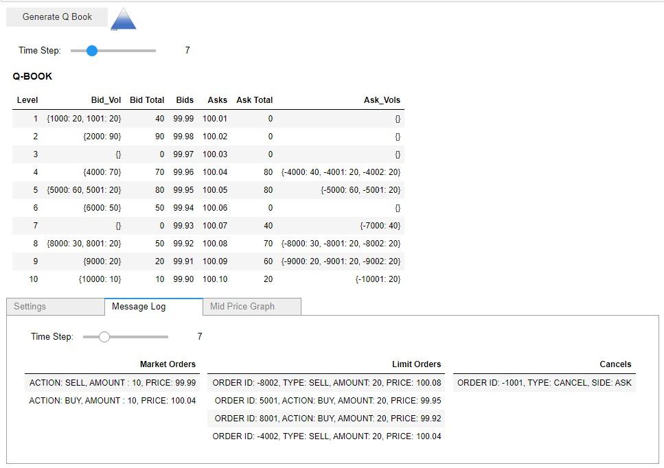

[Kevin Ramlal Homepage](https://kevinramlal.github.io)

## Q-Book Overview

Q-Book is a python based limit order book simulator designed to showcase the basic functionality of real-world limit order books. Using a GUI, users can experiment with different settings for market orders, limit orders, cancellations, as well as see a market-making algorithm in action! 

## [Launch Q-Book](https://mybinder.org/v2/gh/kevinramlal/Q-Book/master?filepath=.%2FQBook.ipynb)
Opens up a Binder containing QBook Jupyter Notebook. For instructions on usage see *Q-Book Quickstart Guide*. Note this may take a few minutes if it's the first time launching!

[Q-BOOK Quickstart Guide (In-Progress)](./QBook/quickstart.md)

