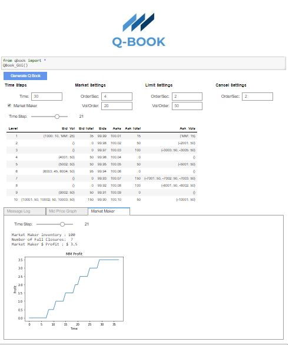

[Kevin Ramlal Homepage](https://kevinramlal.github.io)

# Q-Book Overview

Q-Book is a python based limit order book simulator designed to showcase the basic functionality of real-world limit order books. Using a GUI, users can experiment with different settings for market orders, limit orders, cancellations, as well as see a market-making algorithm in action! 

# [Launch Q-Book Binder](https://hub.gke.mybinder.org/user/kevinramlal-q-book-e1o201c9/notebooks/QBook.ipynb)

[Q-BOOK Quickstart Guide (In-Progress)](./QBook/quickstart.md)

